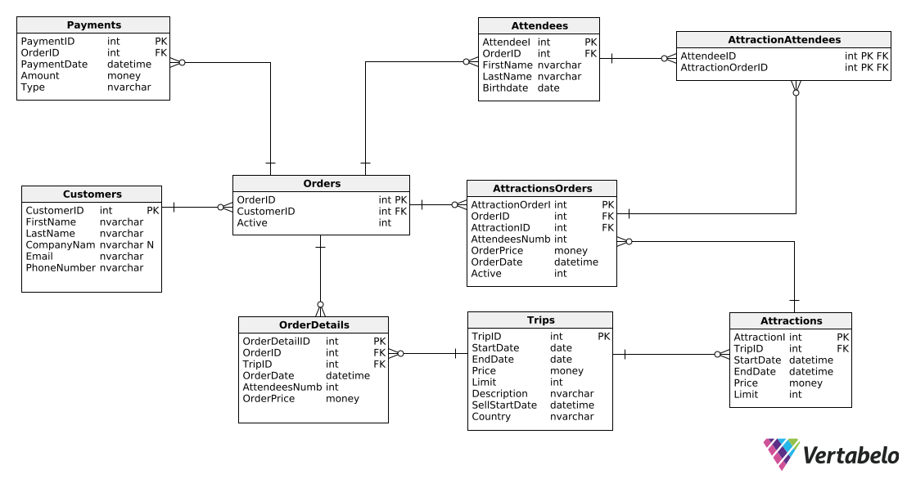
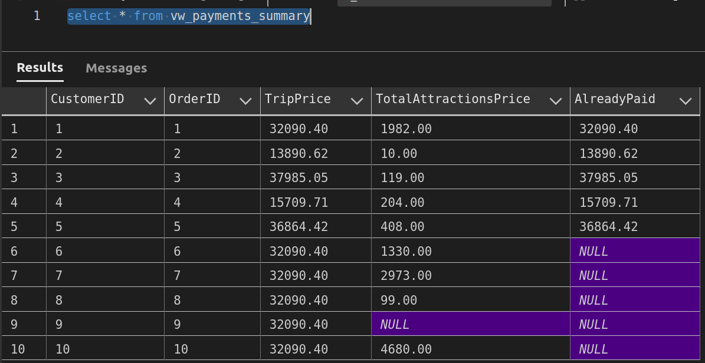
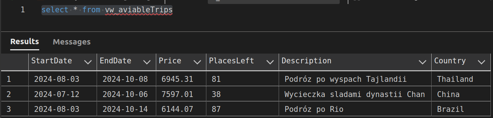
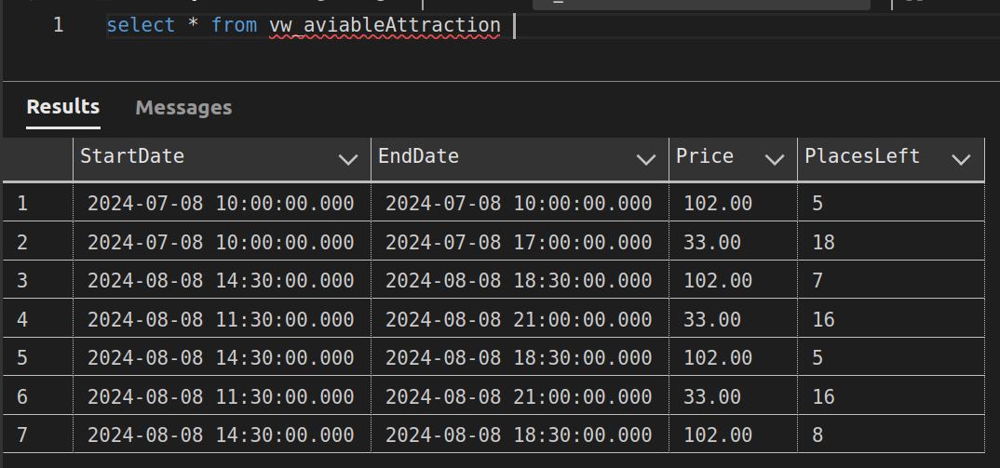
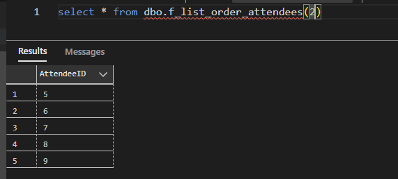
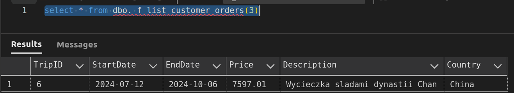
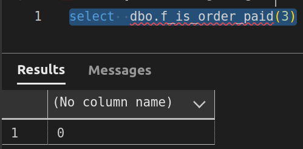
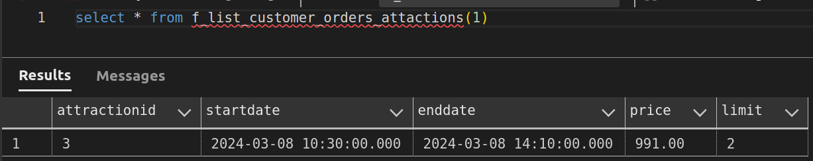

## Michał Fidelus, Jakub Olech, Michał Pęgiel 
# 1.	Wymagania i funkcje systemu
### Użytkownicy

- Tworzenie konta 

- Rezerwacja wycieczki 

- Rezerwacja atrakcji 

- Wgląd do swoich rezerwacji i płatności

### Administrator

- Dodawanie wycieczek/atrakcji

- Dodawanie transportu dla wycieczki/atrakcji

- Dodawanie wpisów z płatnościami

# 2.	Baza danych

## Schemat bazy danych



## Opis poszczególnych tabel

## Nazwa tabeli: Orders
- Opis: Lista zamówień oraz użytkowników, którzy je złożyli

| Nazwa atrybutu | Typ | Opis/Uwagi                 |
|----------------|-----|----------------------------|
| OrderID        | int | PK                         |
| CustomerID     | int | FK -> Customers            |
| Active         | int | 1 - aktywne, 0 - anulowane |


- kod DDL

```sql
CREATE TABLE Orders (
    OrderID int  NOT NULL IDENTITY(1, 1),
    CustomerID int  NOT NULL,
    Active int  NOT NULL DEFAULT 1 CHECK (Active = 1 or Active = 0),
    CONSTRAINT Orders_pk PRIMARY KEY  (OrderID)
);

ALTER TABLE Orders ADD CONSTRAINT Orders_Customers
    FOREIGN KEY (CustomerID)
    REFERENCES Customers (CustomerID);
```

## Nazwa tabeli: OrderDetails
- Opis: Szczegóły zamówienia

| Nazwa atrybutu  | Typ      | Opis/Uwagi                                       |
|-----------------|----------|--------------------------------------------------|
| OrderDetailID   | int      | PK                                               |
| OrderID         | int      | FK   -> Orders                                   |
| TripID          | int      | FK   -> Trips                                    |
| OrderDate       | datetime | data złozenia zamówienia                         |
| AttendeesNumber | int      | ilość uczestników podawana w momencie rezerwacji |
| OrderPrice      | money    | cena wycieczki                                   |


- kod DDL

```sql
CREATE TABLE OrderDetails (
    OrderDetailID int  NOT NULL IDENTITY(1, 1),
    OrderID int  NOT NULL,
    TripID int  NOT NULL,
    OrderDate datetime  NOT NULL,
    AttendeesNumber int  NOT NULL DEFAULT 0 CHECK (AttendeesNumber > 0),
    OrderPrice money  NOT NULL DEFAULT 0 CHECK (OrderPrice > 0),
    CONSTRAINT OrderDetails_pk PRIMARY KEY  (OrderDetailID)
);

ALTER TABLE OrderDetails ADD CONSTRAINT OrderDetails_Orders
    FOREIGN KEY (OrderID)
    REFERENCES Orders (OrderID);

ALTER TABLE OrderDetails ADD CONSTRAINT OrderDetails_Trips
    FOREIGN KEY (TripID)
    REFERENCES Trips (TripID);
```

## Nazwa tabeli: Trips
- Opis: Dostępne wycieczki oraz informacje o nich

| Nazwa atrybutu | Typ      | Opis/Uwagi                            |
|----------------|----------|---------------------------------------|
| TripID         | int      | PK                                    |
| StartDate      | date | data rozpoczęcia wycieczki            |
| EndDate        | date | data zakończenia wycieczki            |
| Price          | money    | cena wycieczki od osoby               |
| Limit          | int      | liczba dostępnych miejsc na wycieczce |
| Description    | nvachar  | dodatkowe informacje o wycieczce      |
| SellStartDate  | datetime | data rozpoczęcia sprzedaży            |
| Country        | nvachar  | kraj wycieczki                        |

- kod DDL

```sql
CREATE TABLE Trips (
    TripID int  NOT NULL IDENTITY(1, 1),
    StartDate date  NOT NULL,
    EndDate date  NOT NULL,
    Price money  NOT NULL DEFAULT 0 CHECK (Price > 0),
    Limit int  NOT NULL DEFAULT 0 CHECK (Limit > 0),
    Description nvarchar  NOT NULL,
    SellStartDate datetime  NOT NULL,
    Country nvarchar  NOT NULL,
    CONSTRAINT Trips_pk PRIMARY KEY  (TripID)
);
```

## Nazwa tabeli: AttractionsOrders
- Opis: Zamówienia atrakcji oraz informacje powiązane z zamówieniami

| Nazwa atrybutu    | Typ      | Opis/Uwagi                                                |
|-------------------|----------|-----------------------------------------------------------|
| AttractionOrderID | int      | PK                                                        |
| OrderID           | int      | FK -> AttractionAttendees                                 |
| AttracionID       | int      | FK -> Attractions                                         |
| AttendeesNumber   | int      | ilość uczestników podawana w momencie rezerwacji atrakcji |
| OrderPrice        | money    | cena zamówienia                                           |
| OrderDate         | datetime | data złożenia zamówienia                                  |
| Active            | int      | 1 - aktywne, 0 - anulowane                                |


- kod DDL

```sql
CREATE TABLE AttractionsOrders (
    AttractionOrderID int  NOT NULL IDENTITY(1, 1),
    OrderID int  NOT NULL,
    AttractionID int  NOT NULL,
    AttendeesNumber int  NOT NULL,
    OrderPrice money  NOT NULL CHECK (OrderPrice > 0),
    OrderDate datetime  NOT NULL,
    Active int  NOT NULL DEFAULT 1 CHECK (Active = 1 or Active = 0),
    CONSTRAINT AttractionsOrders_pk PRIMARY KEY  (AttractionOrderID)
);

ALTER TABLE AttractionsOrders ADD CONSTRAINT AttractionsOrders_Attractions
    FOREIGN KEY (AttractionID)
    REFERENCES Attractions (AttractionID);

ALTER TABLE AttractionsOrders ADD CONSTRAINT AttractionsOrders_Orders
    FOREIGN KEY (OrderID)
    REFERENCES Orders (OrderID);
```

## Nazwa tabeli: Attractions
- Opis: Lista dostępnych atrakcji oraz informacje o nich

| Nazwa atrybutu | Typ      | Opis/Uwagi                |
|----------------|----------|---------------------------|
| AttractionID   | int      | PK                        |
| TripID         | int      | DK -> Trips               |
| StartDate      | datetime | data rozpoczęcia atrakcji |
| EndDate        | datetime | data zakończenia atrakcji |
| Price          | money    | cena atrakcji za osobę    |
| Limit          | int      | liczba dostępnych miejsc  |


- kod DDL

```sql
CREATE TABLE Attractions (
    AttractionID int  NOT NULL IDENTITY(1, 1),
    TripID int  NOT NULL,
    StartDate datetime  NOT NULL,
    EndDate datetime  NOT NULL,
    Price money  NOT NULL DEFAULT 0 CHECK (Price > 0),
    Limit int  NOT NULL DEFAULT 0 CHECK (Limit > 0),
    CONSTRAINT Attractions_pk PRIMARY KEY  (AttractionID)
);

ALTER TABLE Attractions ADD CONSTRAINT Attractions_Trips
    FOREIGN KEY (TripID)
    REFERENCES Trips (TripID);
```

## Nazwa tabeli: Attendees
- Opis: Lista uczestników wycieczki i informacje o nich

| Nazwa atrybutu | Typ     | Opis/Uwagi   |
|----------------|---------|--------------|
| AttendeeID     | int     | PK           |
| OrderID        | int     | FK -> Orders |
| FirstName      | nvachar | imię         |
| LastName       | nvachar | nazwisko     |
| BirthDate      | date    | wiek         |


- kod DDL

```sql
CREATE TABLE Attendees (
    AttendeeID int  NOT NULL IDENTITY(1, 1),
    OrderID int  NOT NULL,
    FirstName nvarchar  NOT NULL,
    LastName nvarchar  NOT NULL,
    Birthdate date  NOT NULL,
    CONSTRAINT Attendees_pk PRIMARY KEY  (AttendeeID)
);

ALTER TABLE Attendees ADD CONSTRAINT Attendees_Orders
    FOREIGN KEY (OrderID)
    REFERENCES Orders (OrderID);
```

## Nazwa tabeli: Customers
- Opis: Lista klientów składających zamówienia

| Nazwa atrybutu | Typ     | Opis/Uwagi     |
|----------------|---------|----------------|
| CustomerID     | int     | PK             |
| FirstName      | nvachar | imię           |
| LastName       | nvachar | nazwisko       |
| CompanyName    | nvachar | nazwa firmy N  |
| Email          | nvachar | adres mailowy  |
| PhoneNumber    | nvachar | numer telefonu |


- kod DDL

```sql
CREATE TABLE Customers (
    CustomerID int  NOT NULL IDENTITY(1, 1),
    FirstName nvarchar  NOT NULL,
    LastName nvarchar  NOT NULL,
    CompanyName nvarchar  NULL,
    Email nvarchar  NOT NULL,
    PhoneNumber nvarchar  NOT NULL,
    CONSTRAINT Customers_pk PRIMARY KEY  (CustomerID)
);
```


## Nazwa tabeli: Payments
- Opis: Lista opłat za zamówienia

| Nazwa atrybutu | Typ      | Opis/Uwagi               |
|----------------|----------|--------------------------|
| PaymentID      | int      | PK                       |
| OrderID        | int      | FK -> Orders             |
| PaymentDate    | datetime | data dokonania płatności |
| Amount         | money    | Zapłacona kwota          |
| Type           | nvachar  | Forma płatności          |


- kod DDL

```sql
CREATE TABLE Payments (
    PaymentID int  NOT NULL IDENTITY(1, 1),
    OrderID int  NOT NULL,
    PaymentDate datetime  NOT NULL,
    Amount money  NOT NULL DEFAULT 0 CHECK (Amount >0),
    Type nvarchar  NOT NULL,
    CONSTRAINT Payments_pk PRIMARY KEY  (PaymentID)
);

ALTER TABLE Payments ADD CONSTRAINT Payments_Orders
    FOREIGN KEY (OrderID)
    REFERENCES Orders (OrderID);
```

## Nazwa tabeli: AttractionAttendees
- Opis: Tabela łącząca uczestników wycieczki z wykupionymi atrakcjami

| Nazwa atrybutu   | Typ | Opis/Uwagi                  |
|------------------|-----|-----------------------------|
| AttendeeID       | int | PK, FK -> Attendees         |
| AttracionOrderID | int | PK, FK -> AttractionsOrders |

- kod DDL
```sql
CREATE TABLE AttractionAttendees (
    AttendeeID int  NOT NULL,
    AttractionOrderID int  NOT NULL,
    CONSTRAINT AttractionAttendees_pk PRIMARY KEY  (AttendeeID,AttractionOrderID)
);

ALTER TABLE AttractionAttendees ADD CONSTRAINT AttractionAttendees_Attendees
    FOREIGN KEY (AttendeeID)
    REFERENCES Attendees (AttendeeID);

ALTER TABLE AttractionAttendees ADD CONSTRAINT AttractionAttendees_AttractionsOrders
    FOREIGN KEY (AttractionOrderID)
    REFERENCES AttractionsOrders (AttractionOrderID);
```

# 3.  Widoki, procedury/funkcje, triggery 


## Widoki

### Nazwa widoku: payments_summary
Widok służy do weryfikacji płatności.

| Nazwa atrybutu   | Typ | Opis/Uwagi                  |
|------------------|-----|-----------------------------|
| CustomerID       | int | PK, FK -> Attendees         |
| OrderID          | int | PK, FK -> AttractionsOrders |
| TripPrice               | int | cena wycieczki         |
| TotalAttractionPrice          | int | Łączna cena za atrakcje|
| AlreadyPaid      | int | Uiszczona opłata na moment bieżący         |

- kod DDL
```sql
create or alter view vw_payments_summary
as
select c.CustomerID as CustomerID, o.OrderID, max(od.OrderPrice) as TripPrice,
sum(ao.OrderPrice) as TotalAttractionsPrice, max(Amount) as AlreadyPaid from Orders o
join Customers c on c.CustomerID = o.CustomerID
join OrderDetails od on o.OrderID = od.OrderID
left join AttractionsOrders ao on o.OrderID = ao.OrderID
left join Payments p on o.OrderID = p.OrderID
group by c.CustomerID, o.OrderID
```

### Nazwa widoku: vw_aviableTrips
Widok służy do wyświetlenia dostępnych w tym momencie wycieczek na bazie dat i limitu miejsc.

| Nazwa atrybutu   | Typ | Opis/Uwagi                  |
|------------------|-----|-----------------------------|
| TripID      | int | ID wycieczki         |
| StartDate      | int | Data początku wycieczki         |
| EndDate          | int | Data końca wycieczki  |
| Price               | int | Cena za wycieczke         |
| PlacesLeft          | int | Pozostałe miejsca limit - booked |
| Description      | int | Opis wycieczki         |
| Country      | int | Kraj docelowy wycieczki         |

- kod DDL
```sql
create or alter view vw_aviableTrips
as
select t.TripID, StartDate, EndDate,Price, t.Limit-l.BookedAttendees as PlacesLeft,[Description],Country from Trips t
join (
select sum(od.AttendeesNumber) as BookedAttendees, od.TripID, max(t.Limit) as Limit from orders o 
join OrderDetails od on od.OrderID = o.OrderID
join Trips t on t.TripID = od.TripID
group by od.TripID
) as l on t.TripID = l.TripID
where l.Limit > l.BookedAttendees and getdate() between t.SellStartDate and t.StartDate

```



### Nazwa widoku: vw_aviableAttraction 
Widok służy do wyświetlenia dostępnych w tym momencie atrakcji, dodatkowo pokazuje pozostałą liczbę miejsc per wycieczka.

| Nazwa atrybutu   | Typ | Opis/Uwagi                  |
|------------------|-----|-----------------------------|
| AttractionID      | int | ID atrakcji         |
| StartDate      | int | Data początku atrakcji         |
| EndDate          | int | Data końca atrakcji  |
| Price               | int | Cena za atrakcję         |
| PlacesLeft          | int | Pozostałe miejsca limit - booked |


- kod DDL
```sql
create or alter view vw_aviableAttraction 
as
select a.AttractionID, StartDate, EndDate,Price, a.Limit-l.BookedAttendees as PlacesLeft from Attractions a
join (
select sum(o.AttendeesNumber) as BookedAttendees,a.AttractionID, max(a.Limit) as Limit from AttractionsOrders o
join Attractions a on o.AttractionID = a.AttractionID
group by a.AttractionID
) as l on a.AttractionID = l.AttractionID
where l.Limit > l.BookedAttendees and getdate() between a.Price and a.StartDate
```


## Funkcje

### Nazwa funkcji: f_list_order_attendees
Funkcja zwraca listę uczestników zamówienia o podanym ID zamówienia.
```sql
create or alter function f_list_order_attendees (@OrderID int)
returns table
as return (
    select AttendeeID from Attendees
    where OrderID = @OrderID
    );
```

### Nazwa funkcji: f_list_customer_orders
Funkcja zwraca listę zamówień klienta o podanym ID klienta.
```sql
create or alter function f_list_customer_orders (@CustomerID int)
returns table
as return (
    select T.TripID, T.StartDate, T.EndDate, T.Price, T.Description, T.Country
    from Trips T
    join OrderDetails OD on T.TripID = OD.TripID
    join Orders O on OD.OrderID = O.OrderID
    where CustomerID = @CustomerID
);
```

### Nazwa funkcji: f_is_order_paid
Funkcja zwraca 1 jeśli zamówienie o podanym ID jest opłacone, 0 w przeciwnym wypadku.
```sql
create or alter function f_is_order_paid (@OrderID int)
returns int
as
begin
    declare @total_cost int;
    declare @already_paid int;
    declare @return_value int;

    set @total_cost = (select TripPrice + TotalAttractionsPrice from vw_payments_summary where OrderID = @OrderID);
    set @already_paid = (select AlreadyPaid from vw_payments_summary);

    if @already_paid < @total_cost set @return_value = 0 else set @return_value = 1;
    return @return_value;
end;
```

### Nazwa funkcji: f_list_customer_orders_attactions
Funkcja zwraca listę atrakcji zamówionych przez klienta o podanym ID.
```sql
create or alter function f_list_customer_orders_attactions (@CustomerID int)
returns table
as return (
    select a.attractionid, a.startdate, a.enddate, a.price, a.limit
    from attractions a
    join attractionsorders ao on a.attractionid = ao.attractionid
    join orders o on ao.orderid = o.orderid
    where o.customerid = @CustomerID
);
```


## Procedury

### Nazwa procedury: p_add_order
Procedura pozwala dodać zamówienie do tabeli Orders, sprawda ona istnienie wycieczki o podanym ID w widoku dostępnych wycieczek, 
klient o podanym ID, oraz czy dostępe jest odpowiednio tle miejsc iel podał wprowadzający. 
```sql
create or alter procedure p_add_order
@orderID int, @CustomerID int, @OrderDetailID int, @TripID int, @AtendeesNumber int
as
begin
declare @OrderPrice money;
if not exists (select * from vw_aviableTrips where @TripID = TripId )
    throw 50001, 'No aviable trip with such ID', 1;
if not exists (select * from Customers where @CustomerID = CustomerID )
    throw 50002, 'No aviable customer with such ID', 1;
if @AtendeesNumber not between 0 and (select PlacesLeft from vw_aviableTrips where @TripID = TripID)
    throw 50003, 'Invalid amount of Atendees', 1;
select @OrderPrice = Price from Trips where TripID = @TripID* @AtendeesNumber;
insert [Orders](OrderID, CustomerID)
values(@orderid, @CustomerID);
insert [OrderDetails](OrderDetailID, OrderID, TripID,OrderDate,AttendeesNumber,OrderPrice)
values (@OrderDetailID,@orderID,@TripID,getdate(),@AtendeesNumber,@OrderPrice);
end 
);
```
### Nazwa procedury: p_add_attractionOrder
Procedura pozwala dodać zamówienie do tabeli attractions, sprawdza ona czy w widoku dostępnych wyczieczek istnieje wycieczka o wprowadzanym ID,
czy wprowadzona jest odpowiednia ilość miejsc, oraz czy istnieje zamówienie o podawanym ID do którego przypisana atrakcja i czy ta atrakcja 
znajduje się w obrębie wycieczki która odnosi się do zamówienie.
```sql
create or alter procedure p_add_attractionOrder
@orderID int, @AttractionOrderID int, @AttractionID int, @AtendeesNumber int
as
begin
declare @OrderPrice money;
declare @TripID int;
select @TripID = TripID from OrderDetails where OrderID = @orderID;
if not exists (select * from vw_aviableAttraction where @AttractionID = AttractionID )
    throw 50001, 'No aviable Attraction with such ID', 1;
if not exists (select * from Orders where @orderID = OrderID )
    throw 50002, 'No aviable Order with such ID', 1;
if @AtendeesNumber not between 0 and (select PlacesLeft from vw_aviableAttraction where @AttractionID = AttractionID)
    throw 50003, 'Invalid amount of Atendees', 1;
if not exists (select AttractionID from Attractions where TripID = @TripID and AttractionID = @AttractionID )
    throw 50004, 'This attraction is not aviable on that trip', 1;
select @OrderPrice = Price from Attractions where AttractionID = @AttractionID* @AtendeesNumber;
insert [AttractionsOrders](AttractionOrderID,orderID,AttractionID,AttendeesNumber,OrderPrice,OrderDate)
values(@AttractionOrderID,@orderID,@AttractionID,@AtendeesNumber,@OrderPrice,getdate());
end 
```

## Triggery

(dla każdego triggera należy wkleić kod polecenia definiującego trigger wraz z komentarzem)


# 4. Inne

### Uprawnienia
Wydano uprawnienia dla 
```sql
use  u_fidelus

create user u_olech from login u_olech ;  
create user u_pegiel from login u_pegiel ;

exec sp_addrolemember 'db_owner', u_olech ;
exec sp_addrolemember 'db_owner', u_pegiel ;
```
### Generowanie danych
Dane zostały wygenerowane za pomoca platformy Mockaroo: https://www.mockaroo.com/

(informacja o sposobie wygenerowania danych, uprawnienia …)
